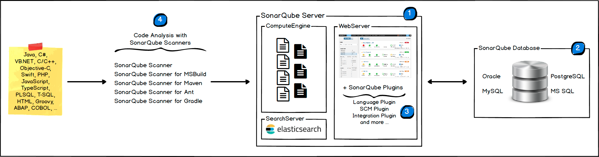
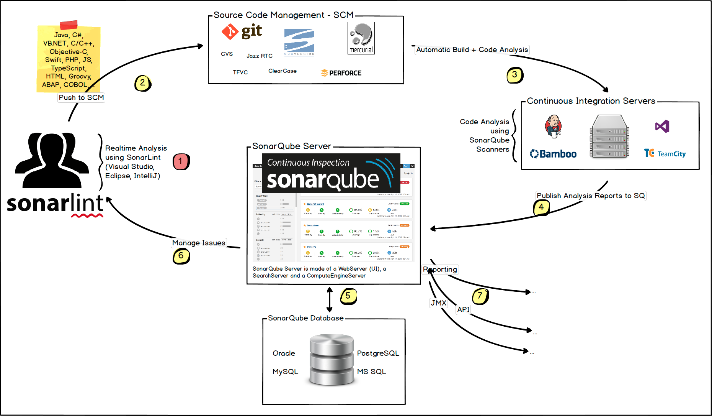

#SonarQube架构与集成

## 平台架构

SonarQube平台由4个组件组成

###SonarQube服务器
- 开发人员和管理员操作频繁，用于浏览代码质量和配置服务器。
- 集成ElasticSearch做搜索服务，用于返回通过UI搜索内容。
- 集成计算引擎处理代码分析后的报告，并将报告保存到数据库。

###SonarQube数据库
- 存储代码分析数据报告。
- 支持oracle、PostgreSQL、MySQL。

###SonarQube插件库
- 通过插件使平台功能更加强大。
- 常用的插件分类： SCM、集成、身份验证、管理维护等插件。

###SonarQube扫描器
- 客户端工具，用于扫描项目。
- 将扫描结果上传到服务器。

## 开发工作流

###IDE集成
- 开发人员在IDE开发工具中安装SonarLint进行本地代码扫描分析。

###提交代码
- 开发人员将代码提交到常用的版本控制系统中，Gitlab、SVN等。

###触发构建
- 持续集成服务器集成Sonar扫描器对对提交代码进行分析。

###提交分析
- sonar扫描器扫描完成将结果推送到服务器进行处理。
- Sonar服务器将分析结果入库并通过UI展示。

###代码审查
- 开发人员通过UI对代码错误进行分析，减少技术债务。
- 经理从分析中获取分析报告。
- 运维使用API自动获取sonar中的数据，使用JMX监控服务器。

## 关于机器和位置

- 平台不能通过多个sonarqube服务器公用一个数据库。
- 每个组件应单独安装在专用计算机上，这样性能是最好的。
- 扫描器可以在多台机器进行扩展。
- 所有机器的时间应该是同步一致的。
- 服务器与数据库必须位于同一网络中。
- 扫描器和服务器可以不再同一网络中。
- 扫描器和数据库之间是没有通信的。