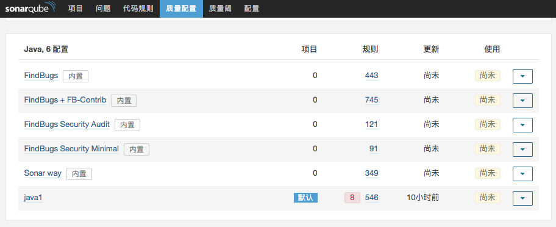

# 自动翻译Sonar规则实践


## 调研web接口


### api/rules/search?languages=java&ps=500&p=1   搜索java规则（所有）

```
{
    "total":1838,
    "p":1,
    "ps":1,
    "rules":[
        {
            "key":"squid:S2589",
            "repo":"squid",
            "name":"Boolean expressions should not be gratuitous",
            "createdAt":"2019-05-02T19:14:49+0800",
            "htmlDesc":"<p>If a boolean expression doesn't change the evaluation of the condition, then it is entirely unnecessary, and can be removed. If it is gratuitous
because it does not match the programmer's intent, then it's a bug and the expression should be fixed.</p>
<h2>Noncompliant Code Example</h2>
<pre>
a = true;
if (a) { // Noncompliant
doSomething();
}

if (b && a) { // Noncompliant; "a" is always "true"
doSomething();
}

if (c || !a) { // Noncompliant; "!a" is always "false"
doSomething();
}
</pre>
<h2>Compliant Solution</h2>
<pre>
a = true;
if (foo(a)) {
doSomething();
}

if (b) {
doSomething();
}

if (c) {
doSomething();
}
</pre>
<h2>See</h2>
<ul>
<li> MISRA C:2004, 13.7 - Boolean operations whose results are invariant shall not be permitted. </li>
<li> MISRA C:2012, 14.3 - Controlling expressions shall not be invariant </li>
<li> <a href="http://cwe.mitre.org/data/definitions/571">MITRE, CWE-571</a> - Expression is Always True </li>
<li> <a href="http://cwe.mitre.org/data/definitions/570">MITRE, CWE-570</a> - Expression is Always False </li>
<li> <a href="http://cwe.mitre.org/data/definitions/489">MITRE, CWE-489</a> - Leftover Debug Code </li>
<li> <a href="https://www.securecoding.cert.org/confluence/x/NYA5">CERT, MSC12-C.</a> - Detect and remove code that has no effect or is never
executed </li>
</ul>",
            "mdDesc":"<p>If a boolean expression doesn't change the evaluation of the condition, then it is entirely unnecessary, and can be removed. If it is gratuitous
because it does not match the programmer's intent, then it's a bug and the expression should be fixed.</p>
<h2>Noncompliant Code Example</h2>
<pre>
a = true;
if (a) { // Noncompliant
doSomething();
}

if (b && a) { // Noncompliant; "a" is always "true"
doSomething();
}

if (c || !a) { // Noncompliant; "!a" is always "false"
doSomething();
}
</pre>
<h2>Compliant Solution</h2>
<pre>
a = true;
if (foo(a)) {
doSomething();
}

if (b) {
doSomething();
}

if (c) {
doSomething();
}
</pre>
<h2>See</h2>
<ul>
<li> MISRA C:2004, 13.7 - Boolean operations whose results are invariant shall not be permitted. </li>
<li> MISRA C:2012, 14.3 - Controlling expressions shall not be invariant </li>
<li> <a href="http://cwe.mitre.org/data/definitions/571">MITRE, CWE-571</a> - Expression is Always True </li>
<li> <a href="http://cwe.mitre.org/data/definitions/570">MITRE, CWE-570</a> - Expression is Always False </li>
<li> <a href="http://cwe.mitre.org/data/definitions/489">MITRE, CWE-489</a> - Leftover Debug Code </li>
<li> <a href="https://www.securecoding.cert.org/confluence/x/NYA5">CERT, MSC12-C.</a> - Detect and remove code that has no effect or is never
executed </li>
</ul>",
            "severity":"MAJOR",
            "status":"READY",
            "isTemplate":false,
            "tags":[

            ],
            "sysTags":[
                "based-on-misra",
                "cert",
                "cwe",
                "misra",
                "redundant"
            ],
            "lang":"java",
            "langName":"Java",
            "params":[

            ],
            "defaultDebtRemFnType":"CONSTANT_ISSUE",
            "defaultDebtRemFnOffset":"10min",
            "debtOverloaded":false,
            "debtRemFnType":"CONSTANT_ISSUE",
            "debtRemFnOffset":"10min",
            "defaultRemFnType":"CONSTANT_ISSUE",
            "defaultRemFnBaseEffort":"10min",
            "remFnType":"CONSTANT_ISSUE",
            "remFnBaseEffort":"10min",
            "remFnOverloaded":false,
            "type":"CODE_SMELL"
        }
    ]
}

```

### api/qualityprofiles/search?language=java&qualityProfile=java1 java1质量信息



- response

```
{
    "profiles":[
        {
            "key":"AWtqxGzkP99GHtfoWcir",
            "name":"java1",
            "language":"java",
            "languageName":"Java",
            "isInherited":false,
            "isDefault":true,
            "activeRuleCount":546,
            "activeDeprecatedRuleCount":8,
            "rulesUpdatedAt":"2019-06-19T01:11:40+0000",
            "userUpdatedAt":"2019-06-19T09:11:40+0800",
            "organization":"default-organization",
            "isBuiltIn":false,
            "actions":{
                "edit":true,
                "setAsDefault":true,
                "copy":true
            }
        }
    ],
    "actions":{
        "create":true
    }
}

```

### api/rules/search?activation=true&qprofile=AWtqxGzkP99GHtfoWcir  java1质量规则

```
{
    "total":546,
    "p":1,
    "ps":1,
    "rules":[
        {
            "key":"squid:S2589",
            "repo":"squid",
            "name":"Boolean expressions should not be gratuitous",
            "createdAt":"2019-05-02T19:14:49+0800",
            "htmlDesc":"<p>If a boolean expression doesn't change the evaluation of the condition, then it is entirely unnecessary, and can be removed. If it is gratuitous
because it does not match the programmer's intent, then it's a bug and the expression should be fixed.</p>
<h2>Noncompliant Code Example</h2>
<pre>
a = true;
if (a) { // Noncompliant
doSomething();
}

if (b && a) { // Noncompliant; "a" is always "true"
doSomething();
}

if (c || !a) { // Noncompliant; "!a" is always "false"
doSomething();
}
</pre>
<h2>Compliant Solution</h2>
<pre>
a = true;
if (foo(a)) {
doSomething();
}

if (b) {
doSomething();
}

if (c) {
doSomething();
}
</pre>
<h2>See</h2>
<ul>
<li> MISRA C:2004, 13.7 - Boolean operations whose results are invariant shall not be permitted. </li>
<li> MISRA C:2012, 14.3 - Controlling expressions shall not be invariant </li>
<li> <a href="http://cwe.mitre.org/data/definitions/571">MITRE, CWE-571</a> - Expression is Always True </li>
<li> <a href="http://cwe.mitre.org/data/definitions/570">MITRE, CWE-570</a> - Expression is Always False </li>
<li> <a href="http://cwe.mitre.org/data/definitions/489">MITRE, CWE-489</a> - Leftover Debug Code </li>
<li> <a href="https://www.securecoding.cert.org/confluence/x/NYA5">CERT, MSC12-C.</a> - Detect and remove code that has no effect or is never
executed </li>
</ul>",
            "mdDesc":"<p>If a boolean expression doesn't change the evaluation of the condition, then it is entirely unnecessary, and can be removed. If it is gratuitous
because it does not match the programmer's intent, then it's a bug and the expression should be fixed.</p>
<h2>Noncompliant Code Example</h2>
<pre>
a = true;
if (a) { // Noncompliant
doSomething();
}

if (b && a) { // Noncompliant; "a" is always "true"
doSomething();
}

if (c || !a) { // Noncompliant; "!a" is always "false"
doSomething();
}
</pre>
<h2>Compliant Solution</h2>
<pre>
a = true;
if (foo(a)) {
doSomething();
}

if (b) {
doSomething();
}

if (c) {
doSomething();
}
</pre>
<h2>See</h2>
<ul>
<li> MISRA C:2004, 13.7 - Boolean operations whose results are invariant shall not be permitted. </li>
<li> MISRA C:2012, 14.3 - Controlling expressions shall not be invariant </li>
<li> <a href="http://cwe.mitre.org/data/definitions/571">MITRE, CWE-571</a> - Expression is Always True </li>
<li> <a href="http://cwe.mitre.org/data/definitions/570">MITRE, CWE-570</a> - Expression is Always False </li>
<li> <a href="http://cwe.mitre.org/data/definitions/489">MITRE, CWE-489</a> - Leftover Debug Code </li>
<li> <a href="https://www.securecoding.cert.org/confluence/x/NYA5">CERT, MSC12-C.</a> - Detect and remove code that has no effect or is never
executed </li>
</ul>",
            "severity":"MAJOR",
            "status":"READY",
            "isTemplate":false,
            "tags":[

            ],
            "sysTags":[
                "based-on-misra",
                "cert",
                "cwe",
                "misra",
                "redundant"
            ],
            "lang":"java",
            "langName":"Java",
            "params":[

            ],
            "defaultDebtRemFnType":"CONSTANT_ISSUE",
            "defaultDebtRemFnOffset":"10min",
            "debtOverloaded":false,
            "debtRemFnType":"CONSTANT_ISSUE",
            "debtRemFnOffset":"10min",
            "defaultRemFnType":"CONSTANT_ISSUE",
            "defaultRemFnBaseEffort":"10min",
            "remFnType":"CONSTANT_ISSUE",
            "remFnBaseEffort":"10min",
            "remFnOverloaded":false,
            "type":"CODE_SMELL"
        }
    ]
}

```

## Python 测试

```
>>> import requests
>>> import json
>>> 
>>> r = requests.get(url="http://xxxxxx:9000/api/rules/search?languages=java&ps=1000&p=1")
>>> 
>>> 
>>> data = json.loads(r.text)
>>> type(data)
<class 'dict'>
>>> data.keys()
dict_keys(['total', 'p', 'ps', 'rules'])
>>> data['rules'][0].keys()
dict_keys(['key', 'repo', 'name', 'createdAt', 'htmlDesc', 'mdDesc', 'severity', 'status', 'isTemplate', 'tags', 'sysTags', 'lang', 'langName', 'params', 'defaultDebtRemFnType', 'defaultDebtRemFnOffset', 'debtOverloaded', 'debtRemFnType', 'debtRemFnOffset', 'defaultRemFnType', 'defaultRemFnBaseEffort', 'remFnType', 'remFnBaseEffort', 'remFnOverloaded', 'type'])

```

## 谷歌翻译脚本

```python

#coding:utf8
import requests
import json
import time
import re
import urllib
import os
import execjs #必须，需要先用pip 安装，用来执行js脚本
import sys
import csv
import subprocess
from bs4 import BeautifulSoup

class Py4Js():     
    def __init__(self):  
        self.ctx = execjs.compile(""" 
              function TL(a) { 
              var k = ""; 
              var b = 406644; 
              var b1 = 3293161072;       
              var jd = "."; 
              var $b = "+-a^+6"; 
              var Zb = "+-3^+b+-f";    
              for (var e = [], f = 0, g = 0; g < a.length; g++) { 
                  var m = a.charCodeAt(g); 
                  128 > m ? e[f++] = m : (2048 > m ? e[f++] = m >> 6 | 192 : (55296 == (m & 64512) && g + 1 < a.length && 56320 == (a.charCodeAt(g + 1) & 64512) ? (m = 65536 + ((m & 1023) << 10) + (a.charCodeAt(++g) & 1023), 
                  e[f++] = m >> 18 | 240, 
                  e[f++] = m >> 12 & 63 | 128) : e[f++] = m >> 12 | 224, 
                  e[f++] = m >> 6 & 63 | 128), 
                  e[f++] = m & 63 | 128) 
              } 
              a = b; 
              for (f = 0; f < e.length; f++) a += e[f], 
              a = RL(a, $b); 
              a = RL(a, Zb); 
              a ^= b1 || 0; 
              0 > a && (a = (a & 2147483647) + 2147483648); 
              a %= 1E6; 
              return a.toString() + jd + (a ^ b) 
            };      
            function RL(a, b) { 
              var t = "a"; 
              var Yb = "+"; 
              for (var c = 0; c < b.length - 2; c += 3) { 
                  var d = b.charAt(c + 2), 
                  d = d >= t ? d.charCodeAt(0) - 87 : Number(d), 
                  d = b.charAt(c + 1) == Yb ? a >>> d: a << d; 
                  a = b.charAt(c) == Yb ? a + d & 4294967295 : a ^ d 
              } 
              return a 
        } 
       """)  

    def getTk(self,text):  
        return self.ctx.call("TL",text)

def buildUrl(text,tk):
    baseUrl='https://translate.google.cn/translate_a/single'
    baseUrl+='?client=t&'
    baseUrl+='sl=auto&'
    baseUrl+='t1=zh-CN&'
    baseUrl+='hl=zh-CN&'
    baseUrl+='dt=at&'
    baseUrl+='dt=bd&'
    baseUrl+='dt=ex&'
    baseUrl+='dt=ld&'
    baseUrl+='dt=md&'
    baseUrl+='dt=qca&'
    baseUrl+='dt=rw&'
    baseUrl+='dt=rm&'
    baseUrl+='dt=ss&'
    baseUrl+='dt=t&'
    baseUrl+='ie=UTF-8&'
    baseUrl+='oe=UTF-8&'
    baseUrl+='otf=1&'
    baseUrl+='pc=1&'
    baseUrl+='ssel=0&'
    baseUrl+='tsel=0&'
    baseUrl+='kc=2&'
    baseUrl+='tk='+str(tk)+'&'
    baseUrl+='q='+text
    
    return baseUrl

def translate(text,index):
    header={
        'authority':'translate.google.cn',
        'method':'GET',
        'path':'',
        'scheme':'https',
        'accept':'*/*',
        'accept-encoding':'gzip, deflate, br',
        'accept-language':'zh-CN,zh;q=0.9',
        'cookie':'',
        'user-agent':'Mozilla/5.0 (Windows NT 10.0; WOW64)  AppleWebKit/537.36 (KHTML, like Gecko) Chrome/63.0.3239.108 Safari/537.36',
        'x-client-data':'CIa2yQEIpbbJAQjBtskBCPqcygEIqZ3KAQioo8oBGJGjygE='
    }
    url=buildUrl(text,js.getTk(text))
    res=''
    try:
      r=requests.get(url)
      result=json.loads(r.text)
      if result[7]!=None:
      # 如果我们文本输错，提示你是不是要找xxx的话，那么重新把xxx正确的翻译之后返回
        try:
              correctText=result[7][0].replace('<b><i>',' ').replace('</i></b>','')
              print(correctText)
              correctUrl=buildUrl(correctText,js.getTk(correctText))
              correctR=requests.get(correctUrl)
              newResult=json.loads(correctR.text)
              res=newResult[0]
        except Exception as e:
              print(e)
              res=result[0][0][0]
      else:

        res = ''
        for i in range(int(index)):
          res= res + result[0][i][0]


  except Exception as e:
      res=''
      print(url)
      print("翻译"+text+"失败")
      print("错误信息:")
      print(e)
  finally:
      return res


class SonarRule(object):

    def __init__(self):
        self.sonarserver = 'http://119.3.228.122:9000/api/rules/search?'
        self.languages = 'java'
        self.searchapi = 'http://119.3.228.122:9000/api/rules/search?activation=true&qprofile=AWtqxGzkP99GHtfoWcir&ps=500'


    def GetRule(self):
        r = requests.get(url=self.searchapi)
        #print(r.status_code)
        #print(r.text)
        if int(r.status_code) == 200 :
            response = json.loads(r.text)

        return response['rules']

    '''
    #print(response.keys())
    #dict_keys(['total', 'p', 'ps', 'rules'])

    #print(response['rules'][0].keys())
    #dict_keys(['key', 'repo', 'name', 'createdAt', 
    #'htmlDesc', 'mdDesc', 'severity', 'status', 'isTemplate', 
    #'tags', 'sysTags', 'lang', 'langName', 'params', 
    #'defaultDebtRemFnType', 'defaultDebtRemFnOffset', 'debtOverloaded', 'debtRemFnType', 'debtRemFnOffset',
     'defaultRemFnType', 'defaultRemFnBaseEffort', 'remFnType', 'remFnBaseEffort', 'remFnOverloaded', 'type'])

    '''


    #filter[name,htmlDesc]
    def FilterTrans(self):
        rules = self.GetRule()
        for i in range(100,499):
            ruleName = rules[i]['name']
            #ruleDesc = rule['htmlDesc'].split('<h2>')[0].replace('<p>','').replace('</p>','').replace('\n','').replace('<code></code>','')
            
            print("Get Rule  [name] and [desc]")
            pattern = re.compile(r'<[^>]+>',re.S)
            ruleDesc = re.sub(pattern,'',rules[i]['htmlDesc'].split('<h2>')[0].replace('\n',' '))
            
            print(i,ruleName)
            print("----------------------")
            print(ruleDesc)
            print("----------------------")

            print("Trans Rule   " + ruleName  )
            
            #计算句点的数量
            index = ruleDesc.count('. ')

            print("----------------------" + str(index))
            res = translate(ruleDesc,index)

            print(type(res))
            print(res)
            
            #save
            with open("sonarqube-rule.txt",'a+',newline='',encoding='utf-8') as datacsv:
              csvwriter = csv.writer(datacsv,dialect=("excel"))
              csvwriter.writerow([str(i),ruleName,str(res),'\n']) 

            '''f = open('','a+')
            f.write(str(i) + ',' + ruleName + ',' + str(res) + '\n')
            f.close()'''

            
            time.sleep(5)


    

if __name__ == '__main__':
    server = SonarRule()
    js=Py4Js()
    server.FilterTrans()
    

```


## 规则翻译内容

```
0,Boolean expressions should not be gratuitous,如果布尔表达式不改变条件的评估，则完全没有必要，并且可以将其删除。如果它是无偿的，因为它与程序员的意图不匹配，那么这是一个错误，表达式应该被修复。,"
"
1,Servlets should not have mutable instance fields,通过契约，servlet容器创建每个servlet的一个实例，然后将专用线程附加到每个新的传入HTTP请求以处理请求。因此，所有线程共享servlet实例，并通过扩展共享它们的实例字段。为了防止在运行时出现任何误解和意外行为，所有servlet字段应该是静态的和/或最终的，或者只是删除。使用Struts 1.X，org.apache.struts.action.Action上存在相同的约束。,"
"
2,"""default"" clauses should be last",switch可以包含一个默认子句，原因有多种：处理意外值，以显示所有案例都已正确考虑。出于可读性目的，为了帮助开发人员快速找到switch语句的默认行为，建议将default子句放在switch语句的末尾。如果default子句不是switch的最后一个案例，则此规则会引发问题。,"
"
3,"""Optional"" should not be used for parameters",Java语言作者非常坦率地说，Optional仅用作返回类型，作为传达方法可能返回值或不返回值的方法。为此，它很有价值，但在输入端使用Optional会增加您在方法中必须完成的工作，而不会真正增加值。使用Optional参数，您可以从两个可能的输入：null和not-null，到三：null，非null-without-value和non-null-with-value。除此之外，长期可以使用重载来传达某些参数是可选的，并且没有理由拥有可选参数。该规则还检查Guava的Optional，因为它是JDK Optional的灵感。虽然在某些方面（序列化，建议用作集合元素）有所不同，但将其用作参数类型会导致与JDK Optional完全相同的问题。,"
"
4,Conditionally executed blocks should be reachable,始终为true或false的条件表达式可能导致死代码。这样的代码总是错误的，不应该在生产中使用。,"
"
5,Overrides should match their parent class methods in synchronization,当同步方法的@Overrides本身不同步时，结果可能是不正确的同步，因为调用者依赖于父类承诺的线程安全性。,"
"

```