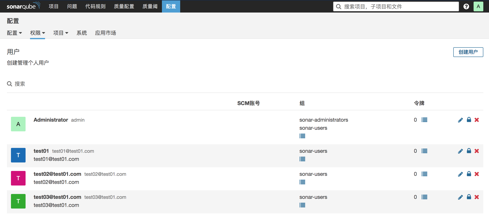
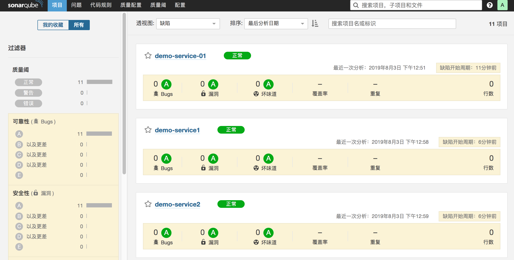
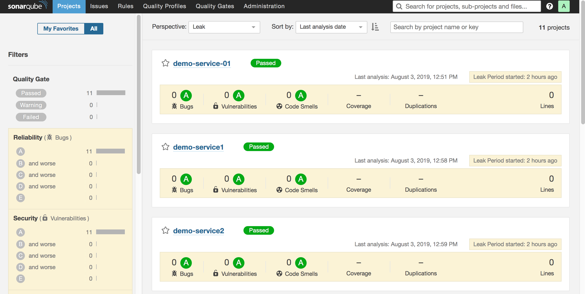
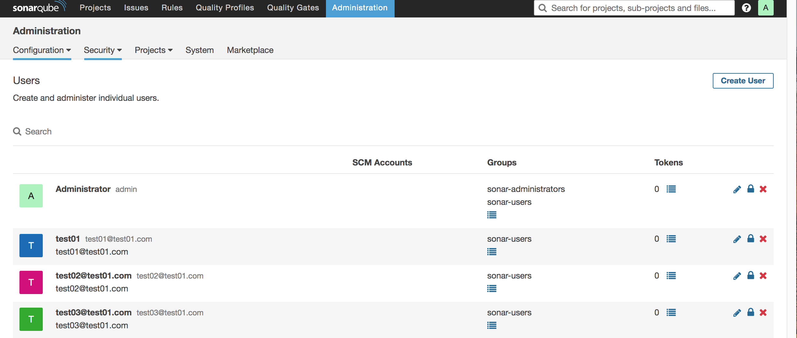
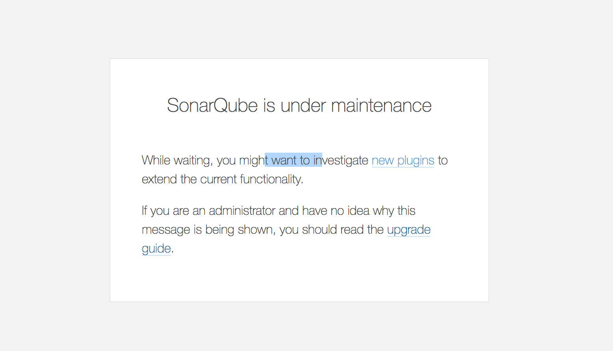
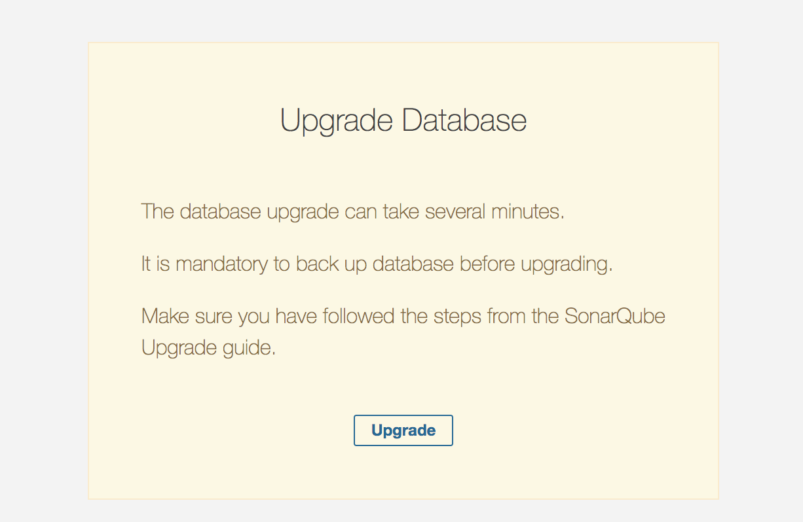
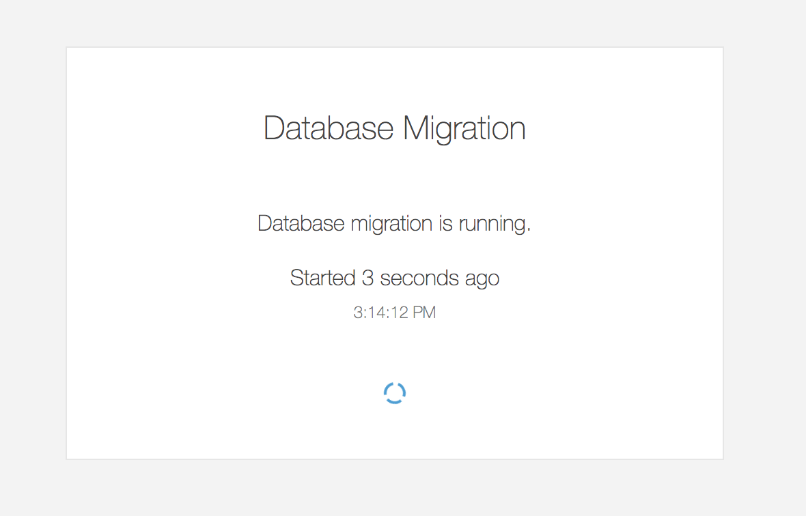
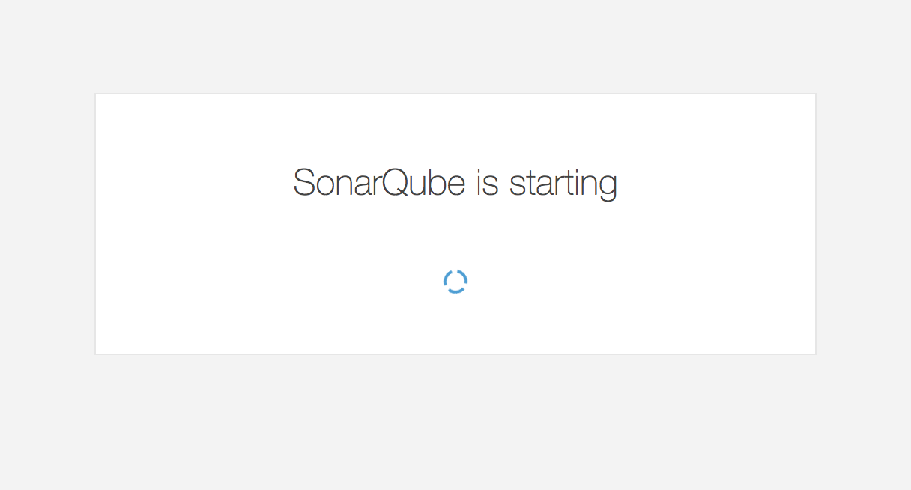
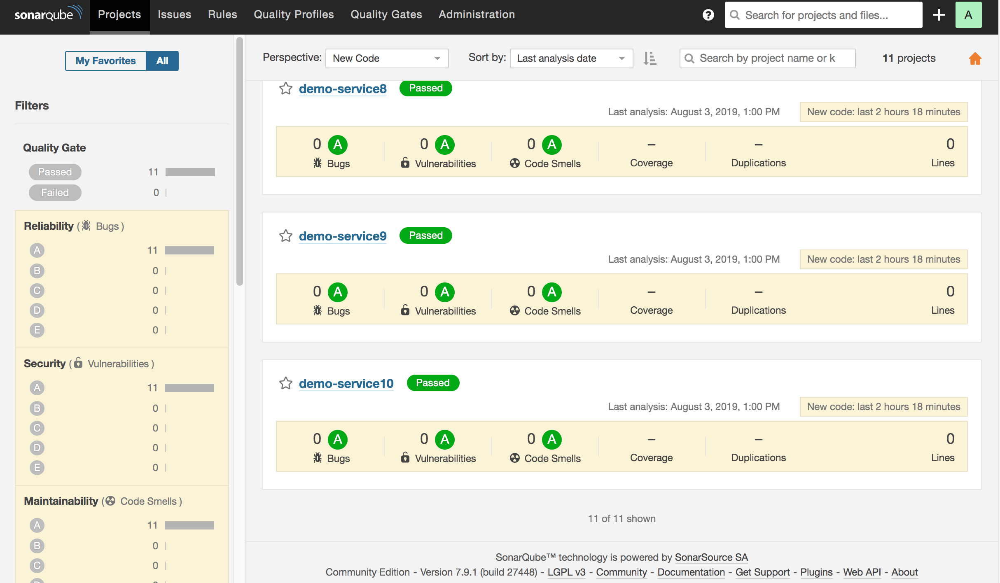
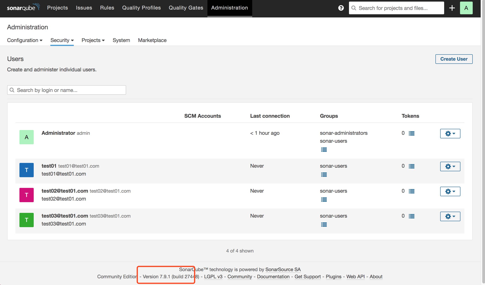

# SonarQube6.7-7.9模拟升级

## 整体思路

- 准备测试数据（实际环境可跳过此步骤）
- 数据库迁移（从版本7.9开始，SonarQube将不再支持MySQL,Mysql-->PG）
- Sonar版本升级（6.7.7 -> 7.9.1）


## 准备测试数据

### 创建用户数据




### 创建项目数据

#### 安装sonar-scanner（mac）

```bash
tar zxf sonar-scanner-4.0.0.1744-macosx.tar.gz -C /usr/local/
export SONAR_HOME=/usr/local/sonar-scanner-4.0.0.1744-macosx
export PATH=$PATH:$M2_HOME/bin:$SONAR_HOME/bin

```

#### 获取maven项目
```
git clone https://github.com/zeyangli/simple-java-maven-app.git
mvn clean package
ls -l target/ | awk '{print $NF}'

classes   
maven-archiver
maven-status
my-app-1.1-SNAPSHOT.jar   
surefire-reports    
test-classes    
```


#### 扫描项目

写个for循环，循环执行。 执行两次该脚本（因第一次分析的时候没有缺陷会不显示数据）

```bash
#!/bin/bash

projectName="demo-service"
scanTime=`date +%Y%m%d%H%M%S`

for((i=1;i<=10;i++))
do
    sonar-scanner  -Dsonar.host.url=http://xxxxxx:9000  \
    -Dsonar.projectKey=${projectName}${i}  \
    -Dsonar.projectName=${projectName}${i}  \
    -Dsonar.projectVersion=${scanTime} \
    -Dsonar.login=admin \
    -Dsonar.password=admin \
    -Dsonar.ws.timeout=30 \
    -Dsonar.projectDescription="my first project!"  \
    -Dsonar.links.homepage=http://www.baidu.com \
    -Dsonar.sources=src \
    -Dsonar.sourceEncoding=UTF-8 \
    -Dsonar.java.binaries=target/classes \
    -Dsonar.java.test.binaries=target/test-classes \
    -Dsonar.java.surefire.report=target/surefire-reports

    echo "${projectName}  scan success!"
done


```
效果




## 准备迁移数据库
- 请注意我们要做的是数据库迁移，是将MySQL迁移到PG数据库。
- 我们需要启动一个跟当前同版本的sonar来完成迁移。
- 若启动不同版本的sonar会报错，详见FAQ2。

### 备份MySQL

```
[root@devops ~]# mysqldump -h 127.0.0.1 -uroot -p sonar >sonar-190803.sql
Enter password:
[root@devops ~]# du -sh sonar-190803.sql
4.6M	sonar-190803.sql
```

### 配置PG

```
#安装
yum install https://download.postgresql.org/pub/repos/yum/9.6/redhat/rhel-7-x86_64/pgdg-centos96-9.6-3.noarch.rpm
yum install postgresql96-server postgresql96-contrib
/usr/pgsql-9.6/bin/postgresql96-setup initdb
systemctl start postgresql-9.6
systemctl enable postgresql-9.6

#创建Sonar数据库
su - postgres
psql
create user sonarqube with password 'sonarqube';
create database sonarqube owner sonarqube;
grant all  on database sonarqube to sonarqube;
\q


#远程访问设置

vi /var/lib/pgsql/9.6/data/postgresql.conf   
#listen_addresses = '*' 
vi /var/lib/pgsql/9.6/data/pg_hba.conf
# IPv4 local connections:
host    all             all             0.0.0.0/0            trust
# IPv6 local connections:
host    all             all             ::1/128                 ident
# Allow replication connections from localhost, by a user with the
# replication privilege.
#local   replication     postgres                                peer
#host    replication     postgres        127.0.0.1/32            ident
#host    replication     postgres        ::1/128                 ident
host    all     all       0.0.0.0/0                ident

```

### 启动新Sonar

```bash
#安装同版本Sonarqube
mkdir pg
unzip sonarqube-6.7.7.zip  -d pg/
cp sonarqube-6.7.7/conf/sonar.properties  pg/sonarqube-6.7.7/conf/sonar.properties


#跟源sonar配置相同，唯一不同的是数据库配置。要改成postgreSQL。
sonar.jdbc.username=xxxx
sonar.jdbc.password=xxxx
sonar.jdbc.url=jdbc:postgresql://127.0.0.1/sonarqube

#一定要启动，否则会报错。提示找到目标数据库中的版本信息。详见FAQ1
./sonar.sh start

```

### MySQL Migrator工具
- 项目信息：https://github.com/SonarSource/mysql-migrator


```
#解压
wget https://binaries.sonarsource.com/Distribution/mysql-migrator/mysql-migrator-1.1.0.119.zip
unzip mysql-migrator-1.1.0.119.zip && cd bin

#source.properties
sonar.jdbc.username=xxxx
sonar.jdbc.password=xxxx
sonar.jdbc.url=jdbc:mysql://localhost:3306/sonar?useUnicode=true&characterEncoding=utf8&rewriteBatchedStatements=true&useConfigs=maxPerformance&useSSL=false

#target.properties
sonar.jdbc.username=xxxx
sonar.jdbc.password=xxxx
sonar.jdbc.url=jdbc:postgresql://127.0.0.1/sonarqube

# 运行迁移工具
./mysql-migrator -source source.properties  -target target.properties
[main] INFO org.sonarsource.sqdbmigrator.migrator.ContentCopier - copying table organizations ...
[main] INFO org.sonarsource.sqdbmigrator.migrator.ContentCopier - copying table organization_members ...
[main] INFO org.sonarsource.sqdbmigrator.migrator.ContentCopier - copying table groups_users ...
[main] INFO org.sonarsource.sqdbmigrator.migrator.ContentCopier - copying table rules_parameters ...
[main] INFO org.sonarsource.sqdbmigrator.migrator.ContentCopier - copying table rules_profiles ...
[main] INFO org.sonarsource.sqdbmigrator.migrator.ContentCopier - copying table org_qprofiles ...
[main] INFO org.sonarsource.sqdbmigrator.migrator.ContentCopier - copying table default_qprofiles ...
[main] INFO org.sonarsource.sqdbmigrator.migrator.ContentCopier - copying table project_qprofiles ...
[main] INFO org.sonarsource.sqdbmigrator.migrator.ContentCopier - copying table qprofile_edit_users ...
[main] INFO org.sonarsource.sqdbmigrator.migrator.ContentCopier - copying table qprofile_edit_groups ...
[main] INFO org.sonarsource.sqdbmigrator.migrator.ContentCopier - copying table groups ...
[main] INFO org.sonarsource.sqdbmigrator.migrator.ContentCopier - copying table snapshots ...
[main] INFO org.sonarsource.sqdbmigrator.migrator.ContentCopier - copying table group_roles ...
[main] INFO org.sonarsource.sqdbmigrator.migrator.ContentCopier - copying table rule_repositories ...
[main] INFO org.sonarsource.sqdbmigrator.migrator.ContentCopier - copying table rules ...
[main] INFO org.sonarsource.sqdbmigrator.migrator.ContentCopier - copying table rules_metadata ...
[main] INFO org.sonarsource.sqdbmigrator.migrator.ContentCopier - copying table events ...
[main] INFO org.sonarsource.sqdbmigrator.migrator.ContentCopier - copying table quality_gates ...
[main] INFO org.sonarsource.sqdbmigrator.migrator.ContentCopier - copying table quality_gate_conditions ...
[main] INFO org.sonarsource.sqdbmigrator.migrator.ContentCopier - copying table properties ...
[main] INFO org.sonarsource.sqdbmigrator.migrator.ContentCopier - copying table project_links ...
[main] INFO org.sonarsource.sqdbmigrator.migrator.ContentCopier - copying table duplications_index ...
[main] INFO org.sonarsource.sqdbmigrator.migrator.ContentCopier - copying table project_measures ...
[main] INFO org.sonarsource.sqdbmigrator.migrator.ContentCopier - copying table internal_properties ...
[main] INFO org.sonarsource.sqdbmigrator.migrator.ContentCopier - copying table projects ...
[main] INFO org.sonarsource.sqdbmigrator.migrator.ContentCopier - copying table manual_measures ...
[main] INFO org.sonarsource.sqdbmigrator.migrator.ContentCopier - copying table active_rules ...
[main] INFO org.sonarsource.sqdbmigrator.migrator.ContentCopier - copying table notifications ...
[main] INFO org.sonarsource.sqdbmigrator.migrator.ContentCopier - copying table user_roles ...
[main] INFO org.sonarsource.sqdbmigrator.migrator.ContentCopier - copying table active_rule_parameters ...
[main] INFO org.sonarsource.sqdbmigrator.migrator.ContentCopier - copying table users ...
[main] INFO org.sonarsource.sqdbmigrator.migrator.ContentCopier - copying table metrics ...
[main] INFO org.sonarsource.sqdbmigrator.migrator.ContentCopier - copying table loaded_templates ...
[main] INFO org.sonarsource.sqdbmigrator.migrator.ContentCopier - copying table issues ...
[main] INFO org.sonarsource.sqdbmigrator.migrator.ContentCopier - copying table issue_changes ...
[main] INFO org.sonarsource.sqdbmigrator.migrator.ContentCopier - copying table permission_templates ...
[main] INFO org.sonarsource.sqdbmigrator.migrator.ContentCopier - copying table perm_tpl_characteristics ...
[main] INFO org.sonarsource.sqdbmigrator.migrator.ContentCopier - copying table perm_templates_users ...
[main] INFO org.sonarsource.sqdbmigrator.migrator.ContentCopier - copying table perm_templates_groups ...
[main] INFO org.sonarsource.sqdbmigrator.migrator.ContentCopier - copying table qprofile_changes ...
[main] INFO org.sonarsource.sqdbmigrator.migrator.ContentCopier - copying table file_sources ...
[main] INFO org.sonarsource.sqdbmigrator.migrator.ContentCopier - copying table ce_queue ...
[main] INFO org.sonarsource.sqdbmigrator.migrator.ContentCopier - copying table ce_activity ...
[main] INFO org.sonarsource.sqdbmigrator.migrator.ContentCopier - copying table ce_task_characteristics ...
[main] INFO org.sonarsource.sqdbmigrator.migrator.ContentCopier - copying table ce_task_input ...
[main] INFO org.sonarsource.sqdbmigrator.migrator.ContentCopier - copying table ce_scanner_context ...
[main] INFO org.sonarsource.sqdbmigrator.migrator.ContentCopier - copying table user_tokens ...
[main] INFO org.sonarsource.sqdbmigrator.migrator.ContentCopier - copying table webhook_deliveries ...
[main] INFO org.sonarsource.sqdbmigrator.migrator.ContentCopier - copying table es_queue ...
[main] INFO org.sonarsource.sqdbmigrator.migrator.ContentCopier - copying table plugins ...
[main] INFO org.sonarsource.sqdbmigrator.migrator.ContentCopier - copying table project_branches ...
[main] INFO org.sonarsource.sqdbmigrator.migrator.ContentCopier - copying table analysis_properties ...
Tables                    Records  Seconds
------------------------  -------  -------
organizations                   1      0.1
organization_members            4      0.0
groups_users                    5      0.0
rules_parameters              686      0.1
rules_profiles                 18      0.0
org_qprofiles                  18      0.0
default_qprofiles               9      0.1
project_qprofiles               0      0.0
qprofile_edit_users             0      0.0
qprofile_edit_groups            0      0.0
groups                          2      0.0
snapshots                      22      0.0
group_roles                    28      0.0
rule_repositories              25      0.0
rules                        2888      0.3
rules_metadata                  0      0.0
events                         21      0.0
quality_gates                   1      0.0
quality_gate_conditions         5      0.0
properties                      4      0.0
project_links                  11      0.0
duplications_index              0      0.0
project_measures             3839      0.3
internal_properties             3      0.0
projects                       55      0.1
manual_measures                 0      0.0
active_rules                 2957      0.1
notifications                   0      0.0
user_roles                      0      0.0
active_rule_parameters        167      0.0
users                           4      0.0
metrics                       145      0.0
loaded_templates                2      0.0
issues                        473      0.1
issue_changes                   0      0.0
permission_templates            1      0.0
perm_tpl_characteristics        0      0.0
perm_templates_users            0      0.0
perm_templates_groups           4      0.0
qprofile_changes             6543      0.3
file_sources                   22      0.0
ce_queue                        0      0.0
ce_activity                    22      0.0
ce_task_characteristics         0      0.0
ce_task_input                   0      0.0
ce_scanner_context             22      0.0
user_tokens                     0      0.0
webhook_deliveries              0      0.0
es_queue                        0      0.0
plugins                        14      0.0
project_branches               11      0.0
analysis_properties             0      0.0

Migration successful in 2.7 seconds


#检查pg中的数据
\c sonarqube
\dt
select * from projects;


```

### 重启服务
```
#清除es索引
rm -fr data/es5

#重启服务
./sonar.sh restart

```

### 验证数据
项目信息



用户信息



### 总结
- 到此数据迁移完成，开始准备后面的工作。将sonarqube版本升级到7.9.1 LTS


## 升级7.9.1

### 安装JDK11
```bash
#因为现在在通过jdk8运行sonar6.7.7，所以暂时可以不配置全局变量，升级完成后将jdk11配置成全局即可。
tar zxf jdk-11_linux-x64_bin.tar.gz -C /usr/local/

```

### 配置SonarQube7.9.1
```
https://binaries.sonarsource.com/Distribution/sonarqube/sonarqube-7.9.1.zip
unzip sonarqube-7.9.1.zip
cp pg/sonarqube-6.7.7/conf/sonar.properties  sonarqube-7.9.1/conf/sonar.properties

# sonarqube 7.9.1 必须使用jdk11
vim ../../conf/wrapper.conf
wrapper.java.command=/usr/local/jdk-11/bin/java

```

### 切换服务
```
#停止旧版本
cd pg/sonarqube-6.7.7/bin/linux-x86-64/
./sonar.sh stop

#启动新版本
cd sonarqube-7.9.1/bin/linux-x86-64/
./sonar.sh start

```

启动后会看到如下错误，需要初始化服务。


初始化服务
http://119.3.228.122:9000/setup






哈哈哈哈哈 升级完成了，数据未丢失




### 总结
- 升级完成，剩下的就需要安装相关的插件了。


## FAQ
###  1.Could not determine SonarQube version of the target database. Could not select version from schema_migrations. ERROR: relation "schema_migrations" does not exist

新创建的空的PG是不能进行迁移的，需要同版本的soanr使用后才会找到和这个表！
  
### 2.Versions in source and target database don't match: 1838 != 2804

此问题一定要注意在做数据库迁移的时候，先运行一个同版本的新sonar进行迁移哦！
  
### 3.迁移完成没有数据怎么办？ 是不是我操作错误了？
需要先删除es索引再启动sonarqube，详见切换服务部分。

### 4.出现SonarQube is under maintenance
升级后需要初始化详见切换服务部分。
